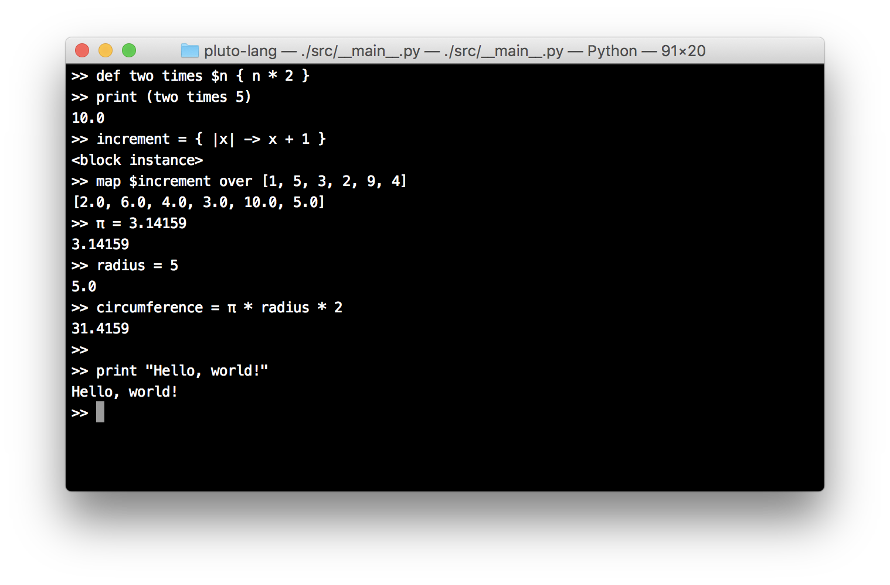

## What?

Pluto is a language with a cool function definition/call syntax. Basically, instead of functions
being called with their arguments in parentheses after the name, they are represented by their patterns:

```r
# defines a pattern: 'this is a pattern'
def this is a pattern {
  ...
}

this is a pattern
```

This snippet defines a function with a pattern of "this is a pattern". Then, whenever a function call is
found, it searches through all the patterns which have been defined and calls the matching one. Coincidentally
this happens on the next line. It matches the pattern and calls whatever's inside the body.

Functions can, of course, also take parameters:

```r
def evaluate $number times $multiplier {
  number * multiplier
}

evaluate 5 times 10
```

This program results in  the value `50`. Hopefully, you can see why. In  a pattern in a function  definition,
when you have a dollar sign before an identifier it means that  it's a parameter. Then, when you call it, you
place an expression inside brackets at that position. Note that, inside the  function body, you don't use the
dollar signs before the variable names. The brackets are required  to resolve any ambiguity.

Another thing -  the pattern in the above examples are  really very  verbose, so it's  probably a bad idea to
make a pattern that long, as it would take longer to type out. For vague guidelines, you might want to have a
look at the **very** tiny standard library. A couple of them are
quite long, but they're probably less used than the others so  the longer length doesn't matter, and improves
readability significantly.



_(note: This language is **incredibly** slow, since it's written in Python. It doesn't matter, as it's just a prototype. However, I'm planning on rewriting in a faster language in the future)_

### Other expressions as arguments

Imagine this:

```r
def double $n {
  n * 2
}

double 5 + 3
```

What would you expect to happen? My guess would be for it to return `16`. But it doesnt - it actually returns
`13`. This is because it actually parses  the function call as `double`, then  the literal `5`, which is then
added to the other literal `3`. Essentially, it's equivalent to this:

```r
(double 5) + 3
```

So how do you avoid this? Well, since the reason it didn't work last time is because  the invisibile brackets
are in the wrong place, so you just need to tell them where to go:

```r
double (5 + 3)
```

This will now give you the result you wanted.

Another problem you might come across is this:

```r
def $a plus $b {
  a + b
}
```

How would you call this? If you did the following:

```r
5 plus 10
```

You'd get an error. This is because the current grammar only allows for _implicit function calls_ if the first
item in the pattern is an identifier, and not an argument. In this case, you need to use an _explicit function call_:

```r
\5 plus 10
```

This would work exactly as you'd expect, returning the value `15`.

## Defining your own if expression

Because of the function calling  syntax, you can actually define your  own pseudo-syntactical constructs. For
example, you could create a function which does the exact same thing as an if expression:

```r
def if $condition then $a else $b {
  if (condition) {
    a
  } else {
    b
  }
}
```

First things first: this is the first time you've seen an if expression in this language. They're fairly
standard. One main difference is that they're expressions, not statements, like in some other languages.

You can then call it like this:

```r
\if (true) then 5 else 10
```

Which, as you can probably guess, will return 5. A few things to mention: you need to use a
backslash before the custom-defined if function, because otherwise it will parse it as a
normal if expression. Also, `true` has to be in a set of parentheses because otherwise it will be
parsed as a normal identifier in the pattern.

This is really cool because, in theory, you could even define the English language as a series of functions!

## Match expressions

Instead of switch-case statements, Pluto has match expressions, similar to Rust:

```r
a = 7

string = match (a) {
  1 => "one"
  2 => "two"
  3 => "three"
  4 => "four"
  5, 6, 7, 8, 9, 10 => {
    print "A large number has been found"
    "quite big"
  }
  * => "something else"
}
```

They're similar to switch-cases, but with a nicer syntax, and also they're expressions instead of statements. When
evaluating a match expression, it goes through each "arm", and if the value in brackets at the top is equal to any
expression in the list before the arrow, it returns the _statement_ on the right, without checking any other arms.

Also, a wildcard will match anything, so make sure it always comes last.

## Blocks

There exists a type known as a block. Here's one:

```r
my_block = {
  print "Hello, world"
}
```

A block basically stores a block of code inside it, which can then be executed on cue, using the `do $block` builtin:

```r
do $my_block
```

This piece of code prints "Hello, world" to the console. Like functions, blocks can recieve arguments:

```r
add = { |a, b| -> a + b }

do $add with [3, 10]
```

This block, called `add`, takes two arguments: `a`, and `b`. It then returns the sum of them. As you can see, to run a
block with arguments, you use the `do $block with $args` builtin, providing the arguments as an array.

An interesting note is that both `do $block` and `do $block with $args` are both defined as normal functions.

Blocks are also used in some functions in the standard library:

```r
map { |n| -> n * n } over [1, 2, 3, 4, 5]  #-> [1, 4, 9, 16, 25]
fold [1, 2, 3, 4, 5] with { |counter, n| -> counter + n }  #-> 15
```

## Collections

A lot of functions in the standard library operate on what's called a _collection_. A collection is a type which can be
represented as a list of elements. There are three collection types currently defined:

 - Array (you've already seen this one)
 - Strings are also collections!
 - A new type: Tuples
 
Before getting into tuples, here's an example using different types of collections:

```r
>>> map { |x| -> x * 2; } over [1, 2, 3, 4, 5]
[2, 4, 6, 8, 10]

>>> map { |x| -> x + "!"; } over "foo"
f!o!o!
```

Just like you've seen before. Now, onto tuples:

```r
a_tuple = (1, 2, 3)
just_one = (1,)
empty = ()
```

Here are three examples of tuples. As you can see, they're defined exactly like lists, except from using normal brackets
instead of square ones.

You can loop over tuples, just like arrays:

```r
for (i : a_tuple) {
  print $i
}
```

### Operators on collections

A few operators are defined on collections:

 - `+` - adds the two collections together
 - `-` - returns the first list with all shared elements removed
 - `&` or `&&` - returns the intersection of the two collections
 - `|` or `||` - returns the union of the two collections
 
## Objects

Objects are similar to dictionaries in Python, or objects in JavaScript:

```r
an_object = [ "x": 3,
              "y": -7,
              true: "A boolean can also be a key ...",
              3: "... as can a number!" ]
```

The syntax is similar to that of an array literal, however between each comma is a `key: value` mapping. You can access
a value at a certain key with the `key $key of $obj` builtin:

```r
key "y" of $an_object
```

Which, of course, returns `-7`.

### Objects as collections

Objects are not collections. This is because there's no good option for what the elements should be. The keys? The
values? Or even, an array containing tuples in the format `(key, value)`. All of these are equally useful, so instead
of making objects collections directly, three builtins are defined:

```r
keys of $obj
values of $obj
pairs of $obj
```

These return the keys, values, and tuple-pairs, respectively, of $obj. These allow for the use of anything collections do:

```r
me = ["name": "Zac", "age": 15]

for (key : keys of $me) {
  printf "%s: %s" with (key, key $key of $me)
}
```

## Classes

Pluto supports some object oriented features, namely classes and inheritance. The class syntax is fairly straightforward:

```r
class Point {
  init at $x $y {
    self.x = x
    self.y = y
  }
  
  def move by $x $y {
    self.x = self.x + x
    self.y = self.y + y
  }
}
```

An `init` method is a constructor, meaning you can instantiate a `Point` with the following syntax:

```r
my_point = Point at 10 3
```

Internally what happens is, when an `init` method is defined, a normal function is defined in the same scope as the
class declaration which creates a new instance of the class, then evaluates the body of the class with that instance.

Therefore, you can override `init` methods, as well as normal functions, which can be useful sometimes.

To call a method on a class instance, you use the `<instance>: <pattern>` syntax, like so:
  
```r
my_point: move by (-10) (-3)

print (my_point.x)
```

Which will print `0.0`. Something interesting to point out is that the values `-10` and `-3` are surrounded in brackets.
This is because, at the moment, the syntax doesn't allow for unary operators in patterns without brackets round them,
although I'd like to change this at some point.

### Inheritance

You can also use inheritance in your classes. I'll probably add an example here at some point, but for now, have a look
at `examples/classes.pluto` to see how.

## Error handling

A lot of the time when programming, you'll get errors, such as `This argument is of an unexpected type`:

```r
do "This is not a block"
```

Since the string `"This is not a block"` isn't a block (remember: the `do $` function executes a block), an error
is thrown:

```r
TypeError: the $block parameter must be of type <block>, not <string>
```

Which is expected. But what if you don't care about this problem? Maybe you want to do something when you encounter an
error; or, just skip past it. To do that, you'd use a _try-catch_ block:

```r
try {
  do "This is not a block"
} catch (err) {
  Type => {
    print "An error occurred!"
  }
}
```

This piece of code, instead of giving you an error message, will just print `"An error occurred!"`. This has the same
powerful syntax as _match_ expressions, so you can write code like this:

```r
try { ... } catch (err) {
  Type, IO => {
    print "A type or IO error occurred!"
  }
  
  * => {
    print "Some other error occurred"
  }
}
```

### Throwing errors

As well as catching already-thrown errors, Pluto also allows you to throw your own. This would be useful if you write a
function in which something can go wrong, and you want to let other people know. You throw an error using error
constructors, the most common being `GeneralError`:

```r
```

A `GeneralError` signifies a generic, possibly unknown, error, but there are more types available to you. These are
their constructors:

```r
GeneralError $msg
TypeError $msg
IOError $msg
SyntaxError $msg
NotImplementedError $msg
```

Which can then be caught in exactly the same way - using the constructor name without the `Error` prefix.

## How??

To use it, clone the repository and run `__main__.py`. Giving it no arguments will run the REPL, in which you can enter
statements line by line.

There are also a number of arguments you can use:

Argument            | Description
--------------------|-----------------------------------------------------
`-f, --file`        | Runs the given file
`-p, --parse`       | Parses the file, but doesn't execute it
`-t, --tree`        | Parses the file and prints the parse tree
`-i, --interactive` | Runs the file and enters interactive mode afterwards
`-h, --help`        | Shows a useful help menu
`-v, --version`     | Shows the current version

## Contributions

Any contributions are welcome. Just send a pull request. I'll probably accept it if it adds anything useful.

### What can I do?

There are loads of things to do. Heres a list for you:

 - Extend the standard library. Literally, put any function in and I'll probably accept it.
 - Write up some better documentation.
 - Add testing.
 - Change syntax so explicit function calls are only necessary with a pattern of length 1.
 - Only throw a syntax error if one hasn't already been thrown in the same statement, to avoid repetition.
 - Rewrite in a faster language - possibly Rust or Go.
 - Add type conversions (maybe `"val -> type"` or `"val as type"`)
 - Add sorting builtins
 - Add importing files
 - Add a module system
 - Make unary operators allowed in patterns
 - Maybe add a regex literal
 - Add a better way of doing string interpolation, maybe `"hello {{x}} {{y + x}}"?`
 - (very tricky,) compile Pluto code to bytecode, to speed up execution
 - Add more examples
 - Convert some language constructs to builtin functions
 - Add more functional/higher order functions
 - Add operator overloading
 - Improve error messages
 - Add list (and object?) comprehensions
 - Maybe rename objects to maps or dictionaries
 - (urgent) Fix ASI to allow trailing comments :(
 - Change syntax to reduce use of braces (maybe terminating with 'end'?)
